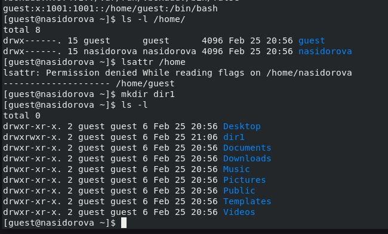
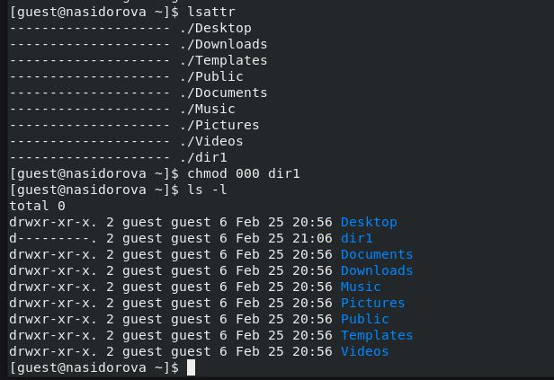
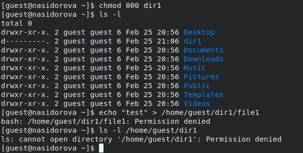
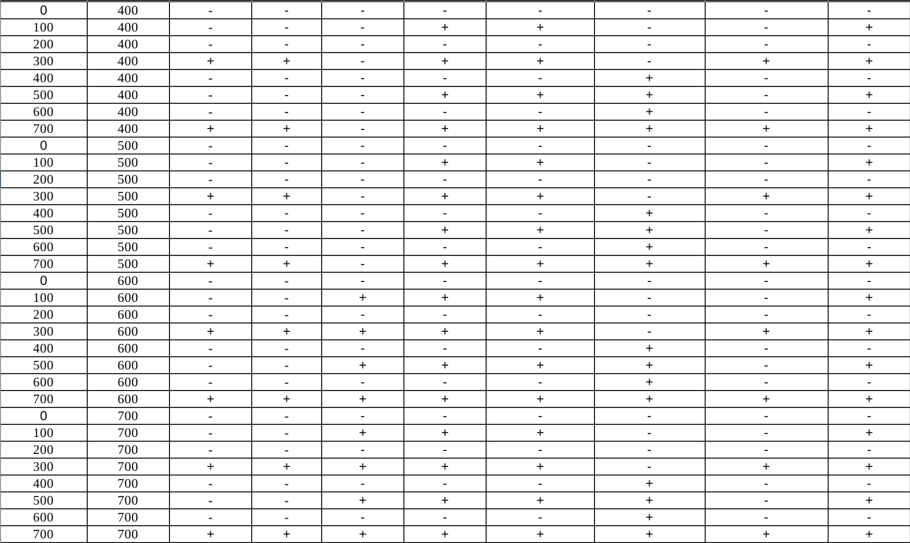
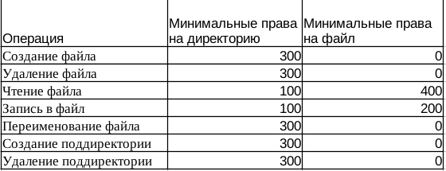

---
## Front matter
lang: ru-RU
title: Презентация к лабораторной работе 2
subtitle: Дискреционное разграничение прав в Linux. Основные атрибуты
author:
  - Сидорова Н. А.
institute:
  - Российский университет дружбы народов, Москва, Россия
  - Объединённый институт ядерных исследований, Дубна, Россия
date: 25 февраля 2024

## i18n babel
babel-lang: russian
babel-otherlangs: english

## Formatting pdf
toc: false
toc-title: Содержание
slide_level: 2
aspectratio: 169
section-titles: true
theme: metropolis
header-includes:
 - \metroset{progressbar=frametitle,sectionpage=progressbar,numbering=fraction}
 - '\makeatletter'
 - '\beamer@ignorenonframefalse'
 - '\makeatother'
---

##
(рис. [-@fig:001]).

{#fig:001 width=70%}

##
(рис. [-@fig:002]).

{#fig:002 width=70%}
##
(рис. [-@fig:003]).

{#fig:003 width=70%}

##
(рис. [-@fig:004]).

{#fig:004 width=70%}
##

(рис. [-@fig:005]).

{#fig:005 width=70%}

##

(рис. [-@fig:006]).

{#fig:006 width=70%}
##
(рис. [-@fig:007]).

{#fig:007 width=70%}
:::

