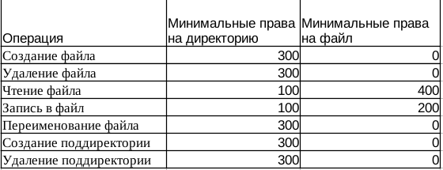

---
## Front matter
title: "Отчёт по лабораторной работе 2"
subtitle: "Дискреционное разграничение прав в Linux. Основные атрибуты"
author: "Сидорова Наталья Андреевна"

## Generic otions
lang: ru-RU
toc-title: "Содержание"

## Bibliography
bibliography: bib/cite.bib
csl: pandoc/csl/gost-r-7-0-5-2008-numeric.csl

## Pdf output format
toc: true # Table of contents
toc-depth: 2
lof: true # List of figures
lot: true # List of tables
fontsize: 12pt
linestretch: 1.5
papersize: a4
documentclass: scrreprt
## I18n polyglossia
polyglossia-lang:
  name: russian
  options:
	- spelling=modern
	- babelshorthands=true
polyglossia-otherlangs:
  name: english
## I18n babel
babel-lang: russian
babel-otherlangs: english
## Fonts
mainfont: PT Serif
romanfont: PT Serif
sansfont: PT Sans
monofont: PT Mono
mainfontoptions: Ligatures=TeX
romanfontoptions: Ligatures=TeX
sansfontoptions: Ligatures=TeX,Scale=MatchLowercase
monofontoptions: Scale=MatchLowercase,Scale=0.9
## Biblatex
biblatex: true
biblio-style: "gost-numeric"
biblatexoptions:
  - parentracker=true
  - backend=biber
  - hyperref=auto
  - language=auto
  - autolang=other*
  - citestyle=gost-numeric
## Pandoc-crossref LaTeX customization
figureTitle: "Рис."
tableTitle: "Таблица"
listingTitle: "Листинг"
lofTitle: "Список иллюстраций"
lotTitle: "Список таблиц"
lolTitle: "Листинги"
## Misc options
indent: true
header-includes:
  - \usepackage{indentfirst}
  - \usepackage{float} # keep figures where there are in the text
  - \floatplacement{figure}{H} # keep figures where there are in the text
---

# Цель работы

Получение практических навыков работы в консоли с атрибутами файлов, закрепление теоретических основ дискреционного разграничения доступа в современных системах с открытым кодом на базе ОС Linux

# Выполнение лабораторной работы

В установленной при выполнении предыдущей лабораторной работы операционной системе создала учётную запись пользователя guest (использую учётную запись администратора)с помощью команды
useradd guest
Задала пароль для пользователя guest (использую учётную запись администратора) с помощью команды
passwd guest
Вошла в систему от имени пользователя guest
Определила директорию, в которой нахожусь, командой pwd. Сравнила её с приглашением командной строки.Уточните имя вашего пользователя командой whoami. Уточнила имя пользователя, его группу, а также группы, куда входит пользователь, командой id. Сравнила вывод id с выводом команды groups. Команда groups вывела только имя пользователя (рис. [-@fig:001]).

{#fig:001 width=70%}

Просмотрела файл /etc/passwd командой cat /etc/passwd
Нашла в нём свою учётную запись в самом конце. Определила uid пользователя - 1001.
Определила gid пользователя - 1001. Найденные значения с полученными в предыдущих пунктах совпадают. Определила существующие в системе директории командой ls -l /home/. Мне удалось получить список поддиректорий директории /home - guest и nasidorova. Проверила, какие расширенные атрибуты установлены на поддиректориях, находящихся в директории /home, командой lsattr /home
Удалось ли вам увидеть расширенные атрибуты директории? Нет, не удалось
Удалось ли вам увидеть расширенные атрибуты директорий других
пользователей? Нет, не удалось. Создала в домашней директории поддиректорию dir1 командой
mkdir dir1
Определила командами ls -l и lsattr, какие права доступа и расширенные атрибуты были выставлены на директорию dir1. (рис. [-@fig:002]).

{#fig:002 width=70%}

Сняла с директории dir1 все атрибуты командой chmod 000 dir1 и проверила с её помощью правильность выполнения команды ls -l. У данной директории нет атрибутов. (рис. [-@fig:003]).

{#fig:003 width=70%}

Попыталась создать в директории dir1 файл file1 командой echo "test" > /home/guest/dir1/file1
Я получила отказ в выполнении операции по созданию файла, так как для этого нет прав. Проверила командой ls -l /home/guest/dir1 что файл file1 не находится внутри директории dir1. (рис. [-@fig:004]).

{#fig:004 width=70%}

(рис. [-@fig:005]).

{#fig:005 width=70%}

(рис. [-@fig:006]).

{#fig:006 width=70%}

рис. [-@fig:007]).

{#fig:007 width=70%}

# Выводы

В ходе проделанной работы я получила практические навыки работы в консоли с атрибутами файлов, закрепила теоретические основы дискреционного разграничения доступа в современных системах с открытым кодом на базе ОС Linux

# Список литературы{.unnumbered}

::: {#refs}
:::
